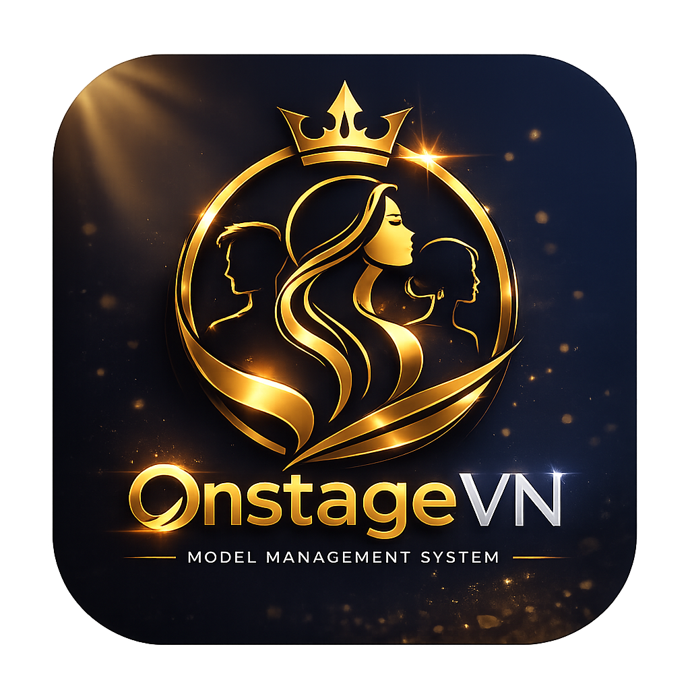
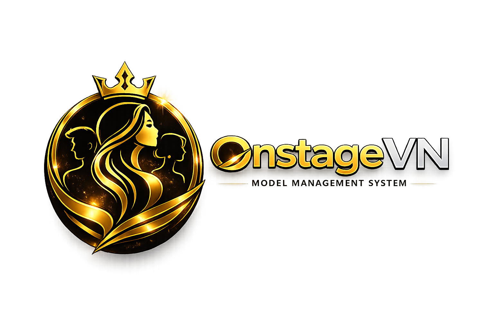

# ONSTAGE VN

# BRAND IDENTITY GUIDELINES

## Bộ Nhận Diện Thương Hiệu

Phiên bản 1.0

---

# 1. GIỚI THIỆU THƯƠNG HIỆU

## Tên thương hiệu

ONSTAGE VN

## Tên đầy đủ

Onstage Viet Nam - Model Management System

## Lĩnh vực

Nền tảng Quản lý Tài năng

Hệ sinh thái Tài năng Sắc đẹp

Kết nối việc làm cho Người mẫu & Người ảnh hưởng (Influencer, KOL)

## Khẩu hiệu

Tôn vinh Sắc đẹp. Tài năng tỏa sáng.

---

# 2. ĐỊNH VỊ THƯƠNG HIỆU

## Tầm nhìn

Trở thành nền tảng quản lý và phát triển tài năng sắc đẹp hàng đầu Việt Nam.

---

## Sứ mệnh

Kết nối tài năng với cơ hội.

Giúp người mẫu, hoa hậu, KOL và nhà sáng tạo nội dung phát triển sự nghiệp một cách chuyên nghiệp và bền vững.

---

## Giá trị cốt lõi

### Excellence

Luôn hướng tới sự xuất sắc.

### Professionalism

Mọi hoạt động đều minh bạch và chuyên nghiệp.

### Opportunity

Tạo ra nhiều cơ hội nghề nghiệp hơn cho tài năng.

### Innovation

Ứng dụng công nghệ để thay đổi ngành công nghiệp sắc đẹp.

### Trust

Xây dựng niềm tin giữa Talent và Brand.

---

# 3. CÂU CHUYỆN THƯƠNG HIỆU

Onstage VN được xây dựng với niềm tin rằng mọi tài năng đều xứng đáng có cơ hội tỏa sáng.

Trong ngành người mẫu và sắc đẹp, việc tìm kiếm cơ hội thường phụ thuộc vào các mối quan hệ cá nhân hoặc các đơn vị trung gian.

Onstage VN ra đời nhằm tạo nên một hệ sinh thái minh bạch, nơi Talent có thể được nhìn thấy và Brand có thể tìm được đúng người.

Từ một hồ sơ cá nhân đơn giản đến một chiến dịch thương hiệu quy mô lớn, mọi cơ hội đều có thể bắt đầu từ Onstage VN.

---

# 4. PHONG CÁCH THƯƠNG HIỆU

## Chuyên nghiệp

Đáng tin cậy.

Chuẩn mực.

Có hệ thống.

---

## Cao cấp

Tinh tế.

Sang trọng.

Đẳng cấp.

---

## Truyền cảm hứng

Khuyến khích phát triển bản thân.

Tôn vinh thành công.

Lan tỏa giá trị tích cực.

---

## Hiện đại

Ứng dụng công nghệ.

Tư duy dữ liệu.

Tối ưu trải nghiệm.

---

# 5. KIẾN TRÚC THƯƠNG HIỆU

## Master Brand

ONSTAGE VN

---

## Product Brands

Onstage Talent

Cổng dành cho Talent

---

Onstage Brand

Cổng dành cho Doanh nghiệp, Nhãn hàng (Brand) và Agency

---

Onstage Admin

Hệ thống quản trị

---

# 6. HỆ THỐNG LOGO

## Logo Chính

Biểu tượng Vương Miện + Talent

Kết hợp chữ OnstageVN

---

## Logo Biểu tượng

Chỉ sử dụng icon.

Dùng cho:

* Avatar
* App Icon
* Favicon
* Social Profile

---

## Logo Ngang

Icon bên trái.

Chữ bên phải.

Dùng cho:

* Header website
* Landing page
* Banner

---

## Logo Watermark

Sử dụng biểu tượng talent + vương miện.

Dùng cho watermark.

---

# 7. Ý NGHĨA LOGO

## Vương miện

Thành công

Danh hiệu

Đẳng cấp

Sự công nhận

---

## Hình tượng người đẹp

Đại diện cho Talent.

---

## Hai nhân vật hai bên

Đại diện cho hệ sinh thái tài năng.

Nam và nữ.

Đa dạng ngành nghề.

---

## Vòng tròn

Sự kết nối.

Sự bảo vệ.

Hệ sinh thái khép kín.

---

# 8. HỆ THỐNG MÀU SẮC

## Primary Gold

Royal Gold

 **HEX #D4A64A** — RGB 212 166 74

---

Premium Gold

 **HEX #F0C56B** — RGB 240 197 107

---

Deep Gold

 **HEX #A87418** — RGB 168 116 24

---

## Primary Navy

Midnight Navy

 **HEX #071B42** — RGB 7 27 66

---

Royal Navy

 **HEX #0B245C** — RGB 11 36 92

---

Deep Ocean

 **HEX #102F73** — RGB 16 47 115

---

## Neutral

White

 **HEX #FFFFFF**

---

Silver

 **HEX #D8DCE5**

---

Gray

 **HEX #6E7481**

---

Dark Gray

 **HEX #2E3440**

---

# 9. GRADIENT CHÍNH

## Luxury Gold

Linear Gradient: `#F0C56B` → `#D4A64A` → `#A87418`

---

## Premium Navy

Linear Gradient: `#102F73` → `#071B42`

---

# 10. TYPOGRAPHY

## Brand Typography

### Heading — Playfair Display

> *Dùng cho tiêu đề lớn, section headers, tên thương hiệu nổi bật*

Onstage VN — Tài năng tỏa sáng

"Elevate Beauty. Empower Talent."

---

### UI Typography — Inter

> *Dùng cho toàn bộ giao diện app, nút bấm, nhãn, mô tả, bảng biểu*

  
LABEL / TAG

  
Nguyễn Mai Anh

  
Model · Hà Nội · Tier A

  
Chiều cao: 172cm &nbsp;|&nbsp; Cân nặng: 51kg &nbsp;|&nbsp; Số đo: 85–60–90

---

### Alternative — Montserrat

> *Phương án dự phòng, dùng khi không load được Inter/Playfair Display*

ONSTAGE VN · MODEL MANAGEMENT SYSTEM

---

# 11. ICONOGRAPHY

## Phong cách icon

> Tất cả icon trong hệ thống dùng **style Outline + Rounded** (viền mỏng, góc bo tròn)

  

    <svg xmlns="http://www.w3.org/2000/svg" width="36" height="36" viewBox="0 0 24 24" fill="none" stroke="#F0C56B" stroke-width="1.8" stroke-linecap="round" stroke-linejoin="round"><path d="M20 21v-2a4 4 0 0 0-4-4H8a4 4 0 0 0-4 4v2"/><circle cx="12" cy="7" r="4"/></svg>
    
Talent

  

  

    <svg xmlns="http://www.w3.org/2000/svg" width="36" height="36" viewBox="0 0 24 24" fill="none" stroke="#F0C56B" stroke-width="1.8" stroke-linecap="round" stroke-linejoin="round"><rect x="2" y="7" width="20" height="14" rx="2" ry="2"/><path d="M16 21V5a2 2 0 0 0-2-2h-4a2 2 0 0 0-2 2v16"/></svg>
    
Brand

  

  

    <svg xmlns="http://www.w3.org/2000/svg" width="36" height="36" viewBox="0 0 24 24" fill="none" stroke="#F0C56B" stroke-width="1.8" stroke-linecap="round" stroke-linejoin="round"><path d="M17 21v-2a4 4 0 0 0-4-4H5a4 4 0 0 0-4 4v2"/><circle cx="9" cy="7" r="4"/><path d="M23 21v-2a4 4 0 0 0-3-3.87"/><path d="M16 3.13a4 4 0 0 1 0 7.75"/></svg>
    
Agency

  

  

    <svg xmlns="http://www.w3.org/2000/svg" width="36" height="36" viewBox="0 0 24 24" fill="none" stroke="#F0C56B" stroke-width="1.8" stroke-linecap="round" stroke-linejoin="round"><polygon points="12 2 15.09 8.26 22 9.27 17 14.14 18.18 21.02 12 17.77 5.82 21.02 7 14.14 2 9.27 8.91 8.26 12 2"/></svg>
    
Campaign

  

  

    <svg xmlns="http://www.w3.org/2000/svg" width="36" height="36" viewBox="0 0 24 24" fill="none" stroke="#F0C56B" stroke-width="1.8" stroke-linecap="round" stroke-linejoin="round"><rect x="3" y="3" width="18" height="18" rx="2"/><circle cx="8.5" cy="8.5" r="1.5"/><polyline points="21 15 16 10 5 21"/></svg>
    
Portfolio

  

  

    <svg xmlns="http://www.w3.org/2000/svg" width="36" height="36" viewBox="0 0 24 24" fill="none" stroke="#F0C56B" stroke-width="1.8" stroke-linecap="round" stroke-linejoin="round"><rect x="3" y="4" width="18" height="18" rx="2" ry="2"/><line x1="16" y1="2" x2="16" y2="6"/><line x1="8" y1="2" x2="8" y2="6"/><line x1="3" y1="10" x2="21" y2="10"/></svg>
    
Booking

  

  

    <svg xmlns="http://www.w3.org/2000/svg" width="36" height="36" viewBox="0 0 24 24" fill="none" stroke="#F0C56B" stroke-width="1.8" stroke-linecap="round" stroke-linejoin="round"><path d="M22 11.08V12a10 10 0 1 1-5.93-9.14"/><polyline points="22 4 12 14.01 9 11.01"/></svg>
    
Verified

  

  

    <svg xmlns="http://www.w3.org/2000/svg" width="36" height="36" viewBox="0 0 24 24" fill="none" stroke="#F0C56B" stroke-width="1.8" stroke-linecap="round" stroke-linejoin="round"><line x1="18" y1="20" x2="18" y2="10"/><line x1="12" y1="20" x2="12" y2="4"/><line x1="6" y1="20" x2="6" y2="14"/></svg>
    
Analytics

  

  

    <svg xmlns="http://www.w3.org/2000/svg" width="36" height="36" viewBox="0 0 24 24" fill="none" stroke="#F0C56B" stroke-width="1.8" stroke-linecap="round" stroke-linejoin="round"><path d="M2 3h6a4 4 0 0 1 4 4v14a3 3 0 0 0-3-3H2z"/><path d="M22 3h-6a4 4 0 0 0-4 4v14a3 3 0 0 1 3-3h7z"/></svg>
    
Training

  

  

    <svg xmlns="http://www.w3.org/2000/svg" width="36" height="36" viewBox="0 0 24 24" fill="none" stroke="#F0C56B" stroke-width="1.8" stroke-linecap="round" stroke-linejoin="round"><path d="M21 10c0 7-9 13-9 13s-9-6-9-13a9 9 0 0 1 18 0z"/><circle cx="12" cy="10" r="3"/></svg>
    
Event

  

---

# 12. PHONG CÁCH HÌNH ẢNH

## Talent Photography

> *Ảnh cá nhân, hồ sơ talent, portfolio model*

  

    
✓ Nên dùng

    <ul style="margin:0;padding-left:16px;color:#D8DCE5;font-size:13px;font-family:Inter,Arial,sans-serif;line-height:2;">
      <li>Ánh sáng studio, nền tối/đen</li>
      <li>Tông màu <b style="color:#D4A64A;">Navy – Gold</b></li>
      <li>Tập trung vào khuôn mặt & thần thái</li>
      <li>Ảnh rõ nét, chỉnh màu chuyên nghiệp</li>
      <li>Phục trang: thời trang, formal, elegant</li>
    </ul>
  

  

    
✗ Không nên

    <ul style="margin:0;padding-left:16px;color:#6E7481;font-size:13px;font-family:Inter,Arial,sans-serif;line-height:2;">
      <li>Ảnh selfie, góc chụp thấp</li>
      <li>Phông nền lộn xộn, ngẫu nhiên</li>
      <li>Ánh sáng vàng, nháy flash cứng</li>
      <li>Ảnh lọc filter quá nhiều</li>
      <li>Phục trang không phù hợp</li>
    </ul>
  

---

## Brand Photography

> *Ảnh doanh nghiệp, sự kiện nhãn hàng, chiến dịch marketing*

  
Phong cách hình ảnh Brand

  

    🏢 Corporate
    🎯 Campaign
    🎪 Event
    💼 Professional Lifestyle
    📸 Product Shot
  

---

## Event Photography

> *Ảnh sân khấu, catwalk, beauty pageant, sự kiện luxury*

  
Từ khóa phong cách

  

    🎭 Sân khấu & Ánh đèn
    👑 Beauty Pageant
    👗 Catwalk Runway
    ✨ Luxury Atmosphere
    💫 Dramatic Lighting
  

---

# 13. PHONG CÁCH THIẾT KẾ GIAO DIỆN

## Design Keywords

Luxury

Modern

Premium

Elegant

Clean

Professional

---

## Border Radius

12px

16px

24px

---

## Shadows

Mềm.

Nhẹ.

Chiều sâu cao cấp.

---

## Glass Effect

Sử dụng có kiểm soát.

Không lạm dụng.

---

## Layout

Whitespace rộng.

Thoáng.

Dễ đọc.

---

# 14. GIỌNG ĐIỆU THƯƠNG HIỆU

## Nên

Truyền cảm hứng.

Chuyên nghiệp.

Tự tin.

Tích cực.

---

## Không nên

Quá giải trí.

Quá bình dân.

Quá khoa trương.

---

Ví dụ

Không dùng:

"Tìm việc ngay hôm nay"

Sử dụng:

"Khám phá những cơ hội phù hợp với tiềm năng của bạn"

---

# 15. THÔNG ĐIỆP THƯƠNG HIỆU

## Talent

Mọi tài năng đều xứng đáng được nhìn thấy.

---

## Brand & Agency

Tìm đúng người cho đúng cơ hội.

---

## Ecosystem

Kết nối tài năng và cơ hội trong một nền tảng duy nhất.

---

# 16. ỨNG DỤNG THƯƠNG HIỆU

## Website

Talent Portal

Brand Portal

Admin Portal

---

## Mobile App

iOS

Android

---

## Social Media

Facebook

Instagram

TikTok

LinkedIn

YouTube

---

## Event

Backdrop

Standee

LED Screen

Name Card

ID Card

Certificate

---

# 17. ĐỊNH VỊ CUỐI CÙNG

ONSTAGE VN

Talent Management & Opportunity Marketplace

Nền tảng kết nối tài năng sắc đẹp, người mẫu, KOL và doanh nghiệp thông qua công nghệ hiện đại, minh bạch và chuyên nghiệp.

Tagline:

Elevate Beauty. Empower Talent.
