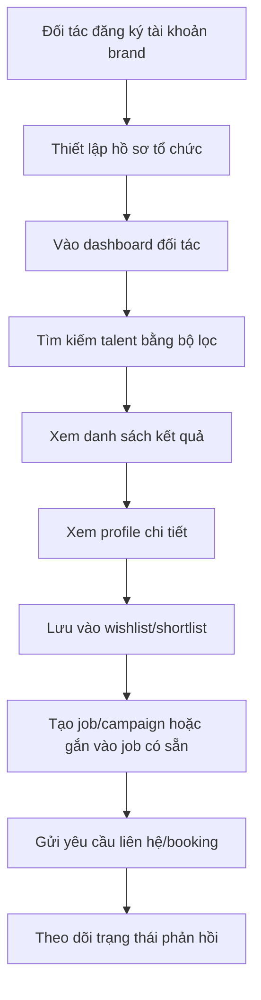

# Kế hoạch phát triển tính năng Giai đoạn 1 MVP - Phía Đối tác

## 1. Mục tiêu tài liệu

Tài liệu này mô tả kế hoạch phát triển tính năng cho **Giai đoạn 1 MVP** dành cho phía đối tác của nền tảng OnstageVN, bao gồm:

- Brands
- Agencies
- Nhà tuyển dụng
- Event organizers
- Marketing agencies
- HR hoặc bộ phận tuyển talent nội bộ

Tài liệu được xây dựng dựa trên:

- `docs/for-tech/README.md`
- `docs/for-bussinees/overview/Luồng 1_ Về luồng vận hành & Tính năng chính.md`

Trong Phase 1, mục tiêu chính không phải xây hệ thống agency phức tạp, mà là giúp đối tác **tìm được talent phù hợp nhanh**, **lưu danh sách ứng viên**, **đăng nhu cầu tuyển dụng cơ bản**, và **tạo tín hiệu booking/liên hệ đầu tiên**.

## 2. Quyết định phạm vi Phase 1

### 2.1. Kiến trúc đang áp dụng

Theo cập nhật kỹ thuật hiện tại:

- Frontend: Next.js App Router.
- Backend: Laravel 12 API trong thư mục `backend/`.
- Xác thực: Laravel Sanctum token.
- Database local: SQLite.
- Giao tiếp frontend/backend: REST API.

Tài liệu cũ có nhắc Laravel + Inertia hoặc Agency Module đầy đủ. Với Phase 1 hiện tại, các phần đó chỉ dùng làm tham khảo nghiệp vụ, không dùng làm kiến trúc triển khai chính.

### 2.2. Actor đăng nhập trong Phase 1

Hiện tại hệ thống chỉ có 2 loại tài khoản đăng nhập:

- `talent`
- `brand`

Vì vậy, trong Phase 1:

- **Brands, Agencies, Nhà tuyển dụng** đều đăng nhập bằng tài khoản `brand`.
- Agency chưa có vai trò đăng nhập riêng.
- Nếu cần phân biệt agency/brand/recruiter trong dữ liệu, dùng trường hồ sơ tổ chức như `organization_type`, không tạo actor auth mới.

### 2.3. Những gì làm trong Phase 1

Phase 1 MVP cho phía đối tác tập trung vào 6 nhóm tính năng:

1. Đăng ký, đăng nhập và thiết lập hồ sơ đối tác.
2. Dashboard tổng quan cho đối tác.
3. Tìm kiếm và lọc talent cơ bản.
4. Xem hồ sơ talent ở mức đủ ra quyết định shortlist.
5. Wishlist/shortlist để lưu talent.
6. Đăng nhu cầu tuyển dụng/campaign cơ bản và quản lý ứng viên ở mức MVP.

### 2.4. Những gì chưa làm trong Phase 1

Các phần sau chưa đưa vào Phase 1 để tránh quá tải:

- Escrow payment đầy đủ.
- Ví đối tác, ví agency, payout, refund.
- Agency member RBAC phức tạp.
- Quản lý roster talent trực thuộc agency.
- In-app chat realtime.
- AI matching tự động nâng cao.
- Elasticsearch production.
- KYC đối tác nâng cao.
- Hợp đồng điện tử.
- Calendar sync Google hai chiều.

Các phần này để Phase 2 hoặc Phase 3.

## 3. Mục tiêu kinh doanh của phía đối tác trong MVP

### 3.1. Mục tiêu chính

Phía đối tác phải đạt được 3 kết quả:

1. Tìm được talent phù hợp trong thời gian ngắn.
2. Có cơ chế lưu, so sánh, quay lại danh sách talent đã chọn.
3. Có thể tạo nhu cầu tuyển dụng/campaign để hệ thống ghi nhận demand.

### 3.2. KPI mục tiêu

| Nhóm KPI | Chỉ số | Mục tiêu MVP |
|---|---:|---:|
| Acquisition | Số đối tác đăng ký | 50 đối tác |
| Activation | Tỷ lệ hoàn tất hồ sơ đối tác | >= 70% |
| Search | Thời gian tìm được danh sách talent đầu tiên | < 5 phút |
| Search | Tỷ lệ search-to-profile-view | >= 30% |
| Conversion | Tỷ lệ search-to-shortlist | >= 15% |
| Conversion | Tỷ lệ shortlist-to-contact/booking request | >= 10% |
| Demand | Số job/campaign được tạo | 30 job/campaign |
| Quality | Tỷ lệ talent trong shortlist có profile đủ dữ liệu | >= 80% |

### 3.3. North Star Metric

North Star Metric cho phía đối tác trong Phase 1:

```text
Số lượt đối tác tạo shortlist hoặc gửi yêu cầu liên hệ/booking mỗi tháng.
```

Lý do chọn chỉ số này:

- Chỉ search không đủ chứng minh nhu cầu thật.
- Shortlist thể hiện đối tác đã thấy talent đủ phù hợp.
- Contact/booking request là tín hiệu rõ nhất cho demand và doanh thu sau này.

## 4. Chân dung người dùng phía đối tác

### 4.1. Brand Manager

Thông tin:

- Làm việc tại nhãn hàng mỹ phẩm, thời trang, FMCG, lifestyle.
- Cần tìm KOL/model/PG/MC cho campaign.
- Thường có deadline gấp.
- Quan tâm đến hình ảnh, độ phù hợp thương hiệu, chỉ số mạng xã hội, ngân sách.

Nhu cầu:

- Tìm talent theo ngoại hình, khu vực, độ tuổi, phong cách.
- Xem portfolio nhanh.
- Lưu danh sách để gửi nội bộ duyệt.
- So sánh nhiều talent cùng lúc.

### 4.2. Event Organizer

Thông tin:

- Tổ chức sự kiện, activation, khai trương, hội nghị.
- Cần PG, MC, model, dancer theo ca/ngày.
- Ưu tiên lịch rảnh, khu vực, chiều cao, kinh nghiệm sự kiện.

Nhu cầu:

- Lọc theo địa điểm, ngày rảnh, loại hình công việc.
- Tìm số lượng talent lớn.
- Cần phản hồi nhanh.
- Muốn shortlist để thay thế nếu talent bận.

### 4.3. Marketing Agency

Thông tin:

- Chạy chiến dịch cho nhiều khách hàng.
- Cần gom talent theo brief.
- Có thể cần nhiều vòng duyệt: nội bộ agency, khách hàng, talent.

Nhu cầu:

- Tạo job/campaign theo brief.
- Lưu nhiều wishlist theo từng khách hàng/campaign.
- Tải hoặc chia sẻ shortlist.
- Theo dõi trạng thái liên hệ.

### 4.4. Nhà tuyển dụng

Thông tin:

- Cần tuyển talent cho dự án, shoot, livestream, event, lookbook.
- Không nhất thiết có quy trình agency chuyên nghiệp.

Nhu cầu:

- Giao diện dễ hiểu.
- Đăng nhu cầu nhanh.
- Xem thông tin cơ bản rõ ràng.
- Có cách liên hệ hoặc gửi yêu cầu đơn giản.

## 5. Nguyên tắc trải nghiệm cho phía đối tác

Từ tài liệu Luồng 1, phía đối tác cần được tối ưu cho desktop/laptop.

### 5.1. Desktop-first

Giao diện đối tác phải ưu tiên:

- Grid profile rộng.
- Bộ lọc bên trái hoặc panel cố định.
- Nhiều thông tin trên một màn hình.
- Dễ so sánh 2-4 talent.
- Bảng danh sách job/campaign rõ ràng.

### 5.2. Tối ưu cho tốc độ ra quyết định

Mỗi màn hình cần trả lời nhanh các câu hỏi:

- Talent này có phù hợp brief không?
- Talent ở đâu?
- Có kinh nghiệm gì?
- Có hình ảnh đủ tốt không?
- Có đang rảnh không?
- Có đáng lưu vào shortlist không?

### 5.3. Trust & Safety

Đối tác cần biết thông tin nào đáng tin:

- Profile đã duyệt hay chưa.
- Ảnh/video có đạt chuẩn không.
- Social account có verified không.
- Talent có rating/review chưa.
- Dữ liệu nào là tự khai, dữ liệu nào đã được hệ thống/admin xác thực.

### 5.4. Progressive Disclosure

Không nhồi mọi thứ vào một màn:

- Card search chỉ hiển thị thông tin tóm tắt.
- Profile detail hiển thị sâu hơn.
- Contact/booking chỉ hiện sau khi đối tác có hành động rõ ràng.
- Tính năng nâng cao như AI matching, escrow, agency team permission để sau.

## 6. User Journey MVP

### 6.1. Journey tổng quát



### 6.2. Journey tìm talent không đăng job

Luồng này phù hợp với brand/event organizer muốn tìm nhanh:

1. Đăng nhập.
2. Vào Brand Portal.
3. Mở `Discover/Tìm tài năng`.
4. Chọn filter: khu vực, loại talent, chiều cao, độ tuổi, phong cách, social.
5. Xem kết quả dạng card.
6. Mở profile chi tiết.
7. Lưu vào shortlist.
8. Gửi yêu cầu liên hệ.

### 6.3. Journey đăng job/campaign trước

Luồng này phù hợp với agency/nhà tuyển dụng có brief rõ:

1. Đăng nhập.
2. Vào `Campaigns/Chiến dịch`.
3. Tạo job/campaign mới.
4. Nhập brief cơ bản.
5. Hệ thống lưu job ở trạng thái `draft` hoặc `published`.
6. Đối tác tìm talent và gắn vào shortlist của job.
7. Gửi yêu cầu liên hệ/booking cho talent được chọn.
8. Theo dõi trạng thái ứng viên.

## 7. Danh sách tính năng Phase 1 MVP

### 7.1. PRT-F01 - Đăng ký/đăng nhập đối tác

Mục tiêu:

- Đối tác có thể tạo tài khoản `brand`.
- Sau đăng nhập, hệ thống đưa vào giao diện Brand Portal.

Phạm vi:

- Đăng ký bằng email/password.
- Social login Google/Facebook nếu cấu hình OAuth.
- Type tài khoản chỉ gồm `talent` và `brand`.
- Đối tác chọn `brand` khi đăng ký.

Không làm:

- Tài khoản agency riêng.
- Đăng nhập bằng OTP.
- Multi-user trong cùng một tổ chức.

Tiêu chí hoàn thành:

- Đăng ký brand thành công.
- Đăng nhập brand tự chuyển về `/brand`.
- Đăng xuất được.
- Backend từ chối type không hợp lệ.

### 7.2. PRT-F02 - Hồ sơ tổ chức đối tác

Mục tiêu:

- Lưu thông tin cơ bản về tổ chức để phục vụ tìm kiếm, job và liên hệ.

Trường dữ liệu MVP:

- Tên tổ chức/cá nhân tuyển dụng.
- Loại tổ chức: `brand`, `agency`, `recruiter`, `event_organizer`.
- Ngành hàng: beauty, fashion, lifestyle, FMCG, event, entertainment.
- Website hoặc fanpage.
- Người phụ trách.
- Số điện thoại liên hệ.
- Email công việc.
- Thành phố.
- Mô tả ngắn.

Gợi ý triển khai dữ liệu:

- Tạo bảng `partner_profiles` khi bắt đầu làm module này.
- `partner_profiles.user_id` liên kết với `users.id`.
- `users.type` vẫn là `brand`.
- `partner_profiles.organization_type` dùng để phân biệt brand/agency/recruiter.

Tiêu chí hoàn thành:

- Brand mới đăng ký được nhắc hoàn thiện hồ sơ tổ chức.
- Hồ sơ tổ chức lưu được.
- Dashboard hiển thị trạng thái hoàn thiện hồ sơ.

### 7.3. PRT-F03 - Dashboard đối tác

Mục tiêu:

- Cho đối tác một màn hình tổng quan sau khi đăng nhập.

Thành phần MVP:

- Lời chào và tên tổ chức.
- Số talent đã lưu.
- Số job/campaign đã tạo.
- Số yêu cầu liên hệ/booking đã gửi.
- Gợi ý hành động tiếp theo:
  - Hoàn thiện hồ sơ tổ chức.
  - Tìm talent.
  - Tạo job/campaign.
  - Xem shortlist.

Không làm:

- Analytics doanh thu.
- Biểu đồ phức tạp.
- Báo cáo ROI.

Tiêu chí hoàn thành:

- Brand vào `/brand/dashboard` thấy dữ liệu cơ bản.
- Nếu chưa có dữ liệu, hiển thị empty state có nút hành động.

### 7.4. PRT-F04 - Tìm kiếm và lọc talent cơ bản

Mục tiêu:

- Đối tác tìm được danh sách talent phù hợp nhanh.

Bộ lọc MVP:

- Từ khóa theo tên.
- Loại talent: model, KOL, PG, MC, dancer, performer.
- Thành phố/khu vực.
- Giới tính.
- Độ tuổi.
- Chiều cao tối thiểu/tối đa.
- Khoảng ngân sách/rate dự kiến.
- Trạng thái verified.
- Tier nếu đã có.
- Social platform chính: Facebook, Instagram, TikTok.

Kết quả hiển thị:

- Ảnh đại diện.
- Tên.
- Loại talent.
- Thành phố.
- Chiều cao/độ tuổi nếu có.
- Tier hoặc trạng thái hồ sơ.
- Số follower tổng hoặc social nổi bật nếu có.
- Nút xem profile.
- Nút lưu shortlist.

Yêu cầu UX:

- Desktop grid 3-4 cột.
- Filter panel bên trái.
- Có sort cơ bản:
  - Mới nhất.
  - Profile hoàn thiện nhất.
  - Phù hợp nhất.
  - Rating cao nhất.

Yêu cầu kỹ thuật MVP:

- Dùng SQL/Eloquent filter trước.
- Chưa cần Elasticsearch.
- Search response mục tiêu < 1 giây với dữ liệu MVP.

Tiêu chí hoàn thành:

- Đối tác filter được danh sách talent.
- Filter không reload toàn trang nếu có thể.
- Kết quả có trạng thái loading/empty/error.

### 7.5. PRT-F05 - Xem profile talent chi tiết

Mục tiêu:

- Đối tác xem đủ thông tin để quyết định shortlist hoặc gửi yêu cầu liên hệ.

Thông tin hiển thị MVP:

- Ảnh đại diện.
- Gallery ảnh.
- Tên hiển thị.
- Thành phố.
- Loại talent.
- Chiều cao, cân nặng, số đo nếu talent công khai.
- Kinh nghiệm.
- Kỹ năng.
- Portfolio/work samples.
- Social accounts.
- Follower count nếu có.
- Profile completion.
- Verified badge.
- Trạng thái lịch rảnh cơ bản nếu có.

Thông tin cần hạn chế:

- Số điện thoại cá nhân.
- Email cá nhân.
- Link liên hệ riêng tư.

Các thông tin này chỉ mở sau hành động unlock/contact request ở các phase sau hoặc theo chính sách MVP.

Tiêu chí hoàn thành:

- Đối tác mở profile từ search.
- Đối tác lưu profile vào wishlist.
- Đối tác quay lại search không mất filter.

### 7.6. PRT-F06 - Wishlist/Shortlist

Mục tiêu:

- Đối tác lưu talent để xem lại, so sánh hoặc gắn vào job/campaign.

Phạm vi MVP:

- Tạo wishlist mặc định.
- Lưu talent vào wishlist.
- Xóa talent khỏi wishlist.
- Xem danh sách talent đã lưu.
- Gắn talent đã lưu vào một job/campaign nếu có.

Phiên bản đơn giản nhất:

- Mỗi brand có một wishlist mặc định tên “Danh sách đã lưu”.

Phiên bản tốt hơn trong MVP:

- Cho tạo nhiều shortlist theo campaign:
  - “Launch mỹ phẩm tháng 7”
  - “PG event Hà Nội”
  - “Lookbook model Q3”

Trường dữ liệu gợi ý:

- `wishlists`: user_id, name, description.
- `wishlist_items`: wishlist_id, talent_user_id hoặc profile_id, notes.

Tiêu chí hoàn thành:

- Lưu talent từ card search.
- Lưu talent từ profile detail.
- Xem được tất cả talent đã lưu.
- Không lưu trùng cùng talent trong cùng wishlist.

### 7.7. PRT-F07 - Tạo job/campaign cơ bản

Mục tiêu:

- Đối tác có thể mô tả nhu cầu tuyển dụng để hệ thống ghi nhận demand.

Trường dữ liệu MVP:

- Tiêu đề job/campaign.
- Loại công việc: model, KOL, PG, MC, dancer, livestream, lookbook.
- Mô tả ngắn.
- Thành phố/địa điểm.
- Ngày bắt đầu.
- Ngày kết thúc.
- Số lượng talent cần tuyển.
- Ngân sách dự kiến.
- Yêu cầu ngoại hình/kỹ năng.
- Trạng thái: draft, published, closed.

Không làm trong Phase 1:

- Auto contract.
- Escrow.
- Bulk import.
- Job template nâng cao.
- Auto repost.

Tiêu chí hoàn thành:

- Đối tác tạo job dạng draft.
- Đối tác publish job.
- Đối tác xem danh sách job đã tạo.
- Đối tác chỉnh sửa job draft/published.
- Đối tác đóng job.

### 7.8. PRT-F08 - Quản lý ứng viên/yêu cầu quan tâm ở mức MVP

Mục tiêu:

- Đối tác theo dõi talent nào đã được chọn cho job/campaign.

Luồng MVP:

- Đối tác tạo job.
- Đối tác tìm talent.
- Đối tác gắn talent vào job shortlist.
- Hệ thống tạo bản ghi `applications` hoặc `job_shortlist_items`.
- Đối tác cập nhật trạng thái:
  - new
  - shortlisted
  - contacted
  - accepted
  - rejected

Không làm:

- Talent tự apply đầy đủ.
- Chat realtime.
- Offer/contract workflow.

Tiêu chí hoàn thành:

- Trong màn job detail, đối tác xem được danh sách talent đã gắn.
- Đối tác đổi trạng thái từng talent.
- Có ghi nhận thời điểm cập nhật trạng thái.

### 7.9. PRT-F09 - Gửi yêu cầu liên hệ/booking sơ bộ

Mục tiêu:

- Tạo tín hiệu conversion thay cho booking/escrow phức tạp.

Phạm vi MVP:

- Button “Gửi yêu cầu liên hệ”.
- Lưu request vào database.
- Talent hoặc admin có thể thấy request ở phase sau.
- Đối tác thấy trạng thái request.

Trạng thái MVP:

- pending
- viewed
- accepted
- declined
- cancelled

Tiêu chí hoàn thành:

- Đối tác gửi request từ profile detail.
- Đối tác gửi request từ job shortlist.
- Request có liên kết với brand, talent, job nếu có.

## 8. Màn hình cần phát triển cho phía đối tác

### 8.1. `/brand/dashboard`

Mục tiêu:

- Tổng quan nhanh về hoạt động của đối tác.

Nội dung:

- Hồ sơ tổ chức.
- Talent đã lưu.
- Job đang mở.
- Yêu cầu liên hệ gần đây.
- CTA tìm talent.
- CTA tạo job.

### 8.2. `/brand/discover`

Mục tiêu:

- Tìm kiếm và lọc talent.

Nội dung:

- Filter sidebar.
- Search input.
- Sort dropdown.
- Talent cards.
- Empty state.
- Loading skeleton.

### 8.3. `/brand/talents/[id]` hoặc modal profile detail

Mục tiêu:

- Xem chi tiết talent.

Nội dung:

- Header profile.
- Gallery.
- Thông tin cơ bản.
- Portfolio.
- Social metrics.
- CTA lưu shortlist.
- CTA gửi yêu cầu liên hệ.

### 8.4. `/brand/shortlists`

Mục tiêu:

- Quản lý talent đã lưu.

Nội dung:

- Danh sách shortlist.
- Talent trong từng shortlist.
- Notes nội bộ.
- Gắn vào job.
- Xóa khỏi shortlist.

### 8.5. `/brand/campaigns`

Mục tiêu:

- Quản lý job/campaign.

Nội dung:

- Danh sách campaign.
- Trạng thái.
- Số talent trong shortlist.
- Nút tạo campaign.

### 8.6. `/brand/campaigns/new`

Mục tiêu:

- Tạo job/campaign nhanh.

Nội dung:

- Form nhập brief.
- Lưu draft.
- Publish.

### 8.7. `/brand/campaigns/[id]`

Mục tiêu:

- Xem chi tiết campaign và talent liên quan.

Nội dung:

- Brief.
- Talent shortlist.
- Trạng thái ứng viên.
- Yêu cầu liên hệ đã gửi.

## 9. Dữ liệu và bảng cần chuẩn bị khi bắt đầu module

Lưu ý: Hiện tại chưa cần tạo các bảng này nếu chưa bắt đầu code module tương ứng.

### 9.1. `partner_profiles`

Mục đích:

- Lưu hồ sơ tổ chức của tài khoản `brand`.

Trường gợi ý:

- `id`
- `user_id`
- `organization_name`
- `organization_type`
- `industry`
- `website_url`
- `fanpage_url`
- `contact_name`
- `contact_phone`
- `contact_email`
- `city`
- `description`
- `verification_status`
- `created_at`
- `updated_at`

### 9.2. `profiles`

Mục đích:

- Lưu hồ sơ talent để đối tác tìm kiếm.

Trường này thuộc phía talent nhưng là nguồn dữ liệu chính cho đối tác.

### 9.3. `wishlists`

Mục đích:

- Nhóm danh sách talent đã lưu theo đối tác/campaign.

Trường gợi ý:

- `id`
- `user_id`
- `name`
- `description`
- `created_at`
- `updated_at`

### 9.4. `wishlist_items`

Mục đích:

- Lưu talent nằm trong wishlist.

Trường gợi ý:

- `id`
- `wishlist_id`
- `profile_id`
- `notes`
- `created_at`
- `updated_at`

### 9.5. `jobs`

Mục đích:

- Lưu nhu cầu tuyển dụng/campaign.

Laravel hiện có bảng `jobs` mặc định cho queue. Khi làm job/campaign nghiệp vụ, cần tránh trùng tên với queue jobs. Có 2 hướng:

- Dùng tên bảng `campaigns`.
- Hoặc đổi queue table sang tên khác và dùng `jobs` cho nghiệp vụ.

Khuyến nghị Phase 1:

```text
Dùng bảng campaigns để tránh xung đột với queue jobs mặc định của Laravel.
```

Trường gợi ý:

- `id`
- `owner_user_id`
- `title`
- `job_type`
- `description`
- `city`
- `location`
- `start_date`
- `end_date`
- `talent_quantity`
- `budget_min`
- `budget_max`
- `requirements`
- `status`
- `published_at`
- `created_at`
- `updated_at`

### 9.6. `campaign_talents`

Mục đích:

- Gắn talent vào campaign shortlist.

Trường gợi ý:

- `id`
- `campaign_id`
- `profile_id`
- `status`
- `notes`
- `created_at`
- `updated_at`

### 9.7. `contact_requests`

Mục đích:

- Lưu yêu cầu liên hệ/booking sơ bộ.

Trường gợi ý:

- `id`
- `brand_user_id`
- `talent_user_id`
- `campaign_id`
- `message`
- `status`
- `created_at`
- `updated_at`

## 10. API cần có trong Phase 1

### 10.1. Partner Profile

```text
GET    /api/partner/profile
PUT    /api/partner/profile
```

### 10.2. Talent Discovery

```text
GET    /api/talents
GET    /api/talents/{profile}
```

Query filter gợi ý:

```text
?q=
&city=
&type=
&gender=
&min_age=
&max_age=
&min_height=
&max_height=
&verified=
&tier=
&sort=
```

### 10.3. Wishlist

```text
GET    /api/wishlists
POST   /api/wishlists
GET    /api/wishlists/{wishlist}
POST   /api/wishlists/{wishlist}/items
DELETE /api/wishlists/{wishlist}/items/{item}
```

### 10.4. Campaigns

```text
GET    /api/campaigns
POST   /api/campaigns
GET    /api/campaigns/{campaign}
PUT    /api/campaigns/{campaign}
POST   /api/campaigns/{campaign}/publish
POST   /api/campaigns/{campaign}/close
```

### 10.5. Campaign Talent Shortlist

```text
GET    /api/campaigns/{campaign}/talents
POST   /api/campaigns/{campaign}/talents
PUT    /api/campaigns/{campaign}/talents/{campaignTalent}
DELETE /api/campaigns/{campaign}/talents/{campaignTalent}
```

### 10.6. Contact Requests

```text
GET    /api/contact-requests
POST   /api/contact-requests
GET    /api/contact-requests/{contactRequest}
POST   /api/contact-requests/{contactRequest}/cancel
```

## 11. Phân quyền MVP

Trong Phase 1, quyền rất đơn giản:

| Hành động | Talent | Brand |
|---|---:|---:|
| Xem dashboard brand | Không | Có |
| Cập nhật partner profile | Không | Có |
| Tìm kiếm talent | Có thể cho xem demo | Có |
| Lưu wishlist | Không | Có |
| Tạo campaign | Không | Có |
| Gửi contact request | Không | Có |
| Xem contact request mình tạo | Không | Có |

Backend cần middleware/policy đảm bảo:

- User `talent` không gọi được API quản lý campaign brand.
- User `brand` chỉ xem/sửa dữ liệu thuộc chính mình.
- Không trả contact/private info nếu chưa có request hợp lệ.

## 12. Roadmap 12 tuần cho phía đối tác

### Sprint 1 - Nền tảng dữ liệu và auth đối tác

Thời gian: Tuần 1-2

Việc cần làm:

- Rà lại auth `brand`.
- Tạo `partner_profiles`.
- API xem/cập nhật partner profile.
- UI nhắc hoàn thiện hồ sơ đối tác.
- Policy kiểm tra user type brand.

Kết quả:

- Đối tác đăng ký, đăng nhập, vào Brand Portal.
- Đối tác lưu được hồ sơ tổ chức.

### Sprint 2 - Talent discovery cơ bản

Thời gian: Tuần 3-4

Việc cần làm:

- Tạo bảng/profile source tối thiểu nếu chưa có.
- API `GET /api/talents`.
- Filter cơ bản.
- UI `/brand/discover`.
- Talent card.
- Empty/loading/error state.

Kết quả:

- Đối tác tìm được danh sách talent.
- Filter trả kết quả đúng.

### Sprint 3 - Profile detail và shortlist

Thời gian: Tuần 5-6

Việc cần làm:

- API talent detail.
- UI profile detail.
- Tạo `wishlists`, `wishlist_items`.
- API wishlist.
- UI lưu/xem/xóa shortlist.

Kết quả:

- Đối tác xem profile chi tiết.
- Đối tác lưu talent vào shortlist.

### Sprint 4 - Campaign/job MVP

Thời gian: Tuần 7-8

Việc cần làm:

- Tạo bảng `campaigns`.
- API CRUD campaign.
- UI danh sách campaign.
- UI tạo campaign.
- Publish/close campaign.

Kết quả:

- Đối tác tạo được job/campaign cơ bản.
- Đối tác xem campaign của mình.

### Sprint 5 - Gắn talent vào campaign và contact request

Thời gian: Tuần 9-10

Việc cần làm:

- Tạo `campaign_talents`.
- Gắn talent từ shortlist/discover vào campaign.
- Tạo `contact_requests`.
- API gửi/cancel contact request.
- UI trạng thái request.

Kết quả:

- Đối tác có thể chuyển từ tìm kiếm sang hành động liên hệ.
- Có dữ liệu demand thật để đo lường.

### Sprint 6 - Kiểm thử, tối ưu UX và soft launch

Thời gian: Tuần 11-12

Việc cần làm:

- Test feature backend.
- Test luồng đối tác end-to-end.
- Tối ưu empty state, loading, validation.
- Seed dữ liệu demo.
- Chuẩn bị dashboard KPI MVP.
- Beta test với nhóm đối tác nhỏ.

Kết quả:

- Sẵn sàng demo/soft launch cho phía đối tác.

## 13. Tiêu chí nghiệm thu Phase 1

### 13.1. Nghiệm thu theo luồng

Luồng 1: Đối tác mới

- Đăng ký brand.
- Đăng nhập.
- Hoàn thiện partner profile.
- Vào dashboard.
- Tìm talent.
- Lưu talent.

Luồng 2: Tạo campaign

- Tạo campaign draft.
- Publish campaign.
- Gắn talent vào campaign.
- Gửi contact request.
- Xem trạng thái request.

Luồng 3: Quản lý shortlist

- Tạo wishlist.
- Lưu talent.
- Thêm note.
- Xóa talent khỏi wishlist.

### 13.2. Nghiệm thu kỹ thuật

- API có test feature.
- Migration rollback được.
- Có policy/middleware phân quyền brand.
- Không trả dữ liệu riêng tư của talent ngoài phạm vi cho phép.
- Search cơ bản hoạt động với pagination.
- Frontend build pass.
- Backend test pass.

### 13.3. Nghiệm thu UX

- Đối tác mới hiểu màn hình trong 30 giây đầu.
- Tìm talent không quá 3 thao tác chính.
- Màn search có loading/empty state.
- Form campaign có validation rõ ràng.
- CTA chính rõ: tìm talent, lưu shortlist, tạo campaign, gửi yêu cầu.

## 14. Rủi ro và cách xử lý

| Rủi ro | Ảnh hưởng | Cách xử lý MVP |
|---|---|---|
| Dữ liệu talent chưa đủ | Search không có giá trị | Seed data demo, ưu tiên hoàn thiện profile talent trước khi mở beta |
| Filter quá nhiều làm rối | Đối tác khó dùng | Chỉ để filter MVP, filter nâng cao đưa vào later |
| Chưa có payment/escrow | Khó thu tiền ngay | Dùng contact request/unlock request làm tín hiệu demand trước |
| Đối tác liên hệ ngoài hệ thống | Mất tracking | Ghi nhận contact request, rating/review sau job |
| Agency cần nhiều user | Không đáp ứng đầy đủ | Phase 1 coi agency là một brand account, team permission để Phase 2 |
| Search chậm khi dữ liệu tăng | UX kém | Phase 1 dùng SQL index, Phase 2 mới cân nhắc Elasticsearch |

## 15. Ưu tiên triển khai

### Must Have

- Partner profile.
- Brand dashboard cơ bản.
- Talent search/filter.
- Talent profile detail.
- Wishlist/shortlist.
- Campaign CRUD cơ bản.
- Contact request.
- Policy bảo vệ dữ liệu brand.

### Should Have

- Nhiều wishlist theo campaign.
- Notes nội bộ trên shortlist.
- Sort theo profile completion/rating.
- Gợi ý talent tương tự.
- Export shortlist CSV/PDF.

### Could Have

- Compare 2-4 talent.
- Saved search.
- Email notification khi request được phản hồi.
- Campaign template.
- Share shortlist bằng link riêng.

### Won't Have trong Phase 1

- Escrow.
- Ví.
- Agency RBAC.
- Hợp đồng.
- Chat realtime.
- AI matching nâng cao.
- Mobile app riêng.

## 16. Kết luận

Phase 1 MVP cho phía đối tác cần được triển khai như một **desktop-first partner workspace**. Trọng tâm không phải là xây thật nhiều tính năng, mà là hoàn thiện vòng lặp giá trị ngắn nhất:

```text
Đăng ký đối tác -> Tìm talent -> Xem profile -> Lưu shortlist -> Tạo campaign -> Gửi yêu cầu liên hệ
```

Khi vòng lặp này chạy được, hệ thống sẽ có dữ liệu thật để đánh giá:

- Đối tác có tìm được talent phù hợp không.
- Talent nào được quan tâm nhiều.
- Bộ lọc nào được dùng nhiều.
- Nhu cầu tuyển dụng tập trung ở job type nào.
- Có đủ tín hiệu để mở monetization ở Phase 2 hay không.

Đây là nền tảng cần thiết trước khi mở rộng sang escrow, agency management, AI matching và payment workflow đầy đủ.
