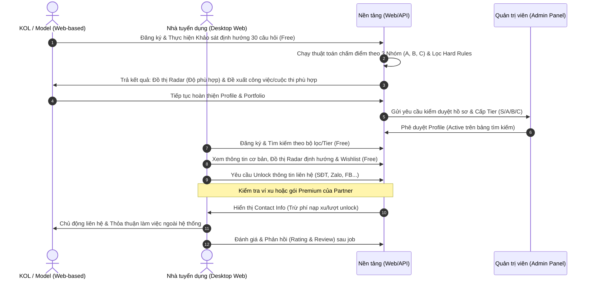
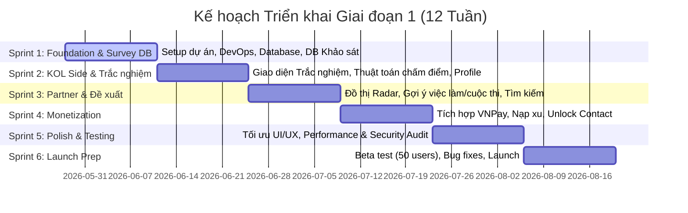

# Kế hoạch Chi tiết Triển khai Giai đoạn 1 (MVP) - Nền tảng Quản lý KOLs & Models

Tài liệu này chi tiết hóa kế hoạch triển khai **Giai đoạn 1 (MVP)** theo các định hướng vận hành, mô hình kinh doanh và kỹ thuật
---

## 1. Tổng quan Giai đoạn 1 (Phase 1: MVP Launch)

### 1.1. Mục tiêu chiến lược
*   **Validate Product-Market Fit (Kiểm chứng thị trường):** Đảm bảo mô hình kết nối giữa KOL/Model và Nhà tuyển dụng hoạt động mượt mà, giải quyết được pain-point của hai bên.
*   **Thu thập Dữ liệu (Gom data):** Tập trung phát triển số lượng profile chất lượng ở phía cung (KOLs/Models) và thu hút các đối tác tuyển dụng hoạt động ở phía cầu.
*   **Tối ưu hóa thời gian & chi phí:** Sử dụng phương pháp phát triển **AI-First** để rút ngắn thời gian hoàn thành xuống **3 tháng (12 tuần)** với chi phí tối ưu (khoảng 81M - 200M VND tùy theo quy mô nguồn lực).

### 1.2. Mục tiêu KPIs (Thành công của MVP)
*   **Số lượng KOL/Model:** Đạt tối thiểu **500 profile** được kích hoạt (active).
*   **Số lượng Đối tác tuyển dụng (Partners):** Đạt tối thiểu **50 đối tác** đăng ký hoạt động.
*   **Lượt kết nối thành công:** Đạt tối thiểu **50 bookings** được kết nối thông qua nền tảng.
*   **Tỷ lệ chuyển đổi thu phí thử nghiệm:** Đạt ít nhất **10 đối tác** thực hiện giao dịch trả phí đầu tiên (mua gói subscription hoặc nạp xu unlock contact).
*   **Hiệu suất hệ thống:** Page load time dưới **2 giây**, tỷ lệ uptime đạt **99.9%**.

---

## 2. Mô hình Vận hành Giai đoạn 1 (Open Marketplace & Career Orientation)

Trong Giai đoạn 1, hệ thống áp dụng mô hình **Kết nối Mở (Open Marketplace)** kết hợp với **Phân hệ Định hướng & Đề xuất thông minh (Career Recommendation)** làm nhân tố cốt lõi thu hút KOL/Model (gom data đầu vào).

### 2.1. Nguyên tắc vận hành chính:
1.  **Phía KOL/Model:** Thực hiện bài trắc nghiệm định hướng nghề nghiệp, nhận đề xuất việc làm/cuộc thi phù hợp, tạo profile và đăng tải portfolio hoàn toàn **Miễn phí**.
2.  **Phía Đối tác:** Đăng ký tài khoản, tìm kiếm, lọc ứng viên theo chỉ số hình thể + thứ hạng Tier + kết quả khảo sát định hướng và lưu danh sách yêu thích **Miễn phí**.
3.  **Điểm thu phí:** Khi Đối tác muốn liên hệ trực tiếp với KOL, họ phải sử dụng **Gói đăng ký (Subscription)** hoặc nạp xu để **Unlock liên hệ (Pay-per-lead)** với mức phí dự kiến là `50,000 VND / lượt unlock`.
    *   *Chiến lược Launching:* Miễn phí 3 tháng đầu hoặc tặng sẵn 5-10 lượt unlock miễn phí khi đăng ký mới để thu hút data đối tác.
4.  **Bypass Risk & Tranh chấp:** Vì giao dịch và thoả thuận diễn ra ngoài hệ thống, platform sẽ kiểm soát chất lượng bằng cơ chế đánh giá (Rating & Review) và huy hiệu Verified (được admin duyệt KYC).

### 2.2. Cơ chế Khảo sát Định hướng Nghề nghiệp & Đề xuất (Cốt lõi MVP)
Hệ thống sẽ đồng hành và định hướng cho KOL ngay từ con số 0 thông qua bộ công cụ khảo sát đầu vào:
1.  **Cấu trúc khảo sát:** Bộ khảo sát gồm 30 câu hỏi chia làm 2 phần:
    *   *Câu 1 - 10:* Thông tin hành chính & Nhân trắc học cơ bản (Tuổi, Chiều cao, Cân nặng, Số đo 3 vòng, Tình trạng phẫu thuật thẩm mỹ, Học vấn, Ngoại ngữ).
    *   *Câu 11 - 30:* Đặc điểm hình thể, phong cách, tài năng, đam mê, tư duy nền tảng & mục tiêu sự nghiệp (chấm điểm theo 3 nhóm xu hướng A, B, C có trọng số).
2.  **Thuật toán lọc và chấm điểm:**
    *   *Bước 1: Lọc điều kiện cần (Hard Rules):* Dựa trên các câu hỏi từ 1-10. Ví dụ: Nếu đã kết hôn/sinh con hoặc đã can thiệp đại phẫu thẩm mỹ → Hệ thống tự động lọc bỏ gợi ý các cuộc thi Hoa hậu quốc gia khắt khe (Hoa hậu Việt Nam...), chuyển hướng gợi ý sang Hoa hậu Quý bà, Hoa khôi du lịch/ngành nghề hoặc Người mẫu/KOL. Nếu chiều cao < 165cm → Loại khỏi nhóm Người mẫu Runway (Nhóm B).
    *   *Bước 2: Tính điểm xu hướng (Scoring):* Cộng tổng điểm 3 nhóm:
        *   **Nhóm A (Hoa hậu/Hoa khôi truyền thống & Nhân ái):** Hợp gu truyền thống, giao tiếp tốt, thích làm thiện nguyện. Gợi ý cuộc thi: Hoa hậu Việt Nam, Miss World VN, Hoa khôi Sinh viên...
        *   **Nhóm B (Người mẫu Runway/Thời trang chuyên nghiệp):** Khung xương góc cạnh, high-fashion, catwalk mạnh mẽ. Gợi ý cuộc thi: Vietnam's Next Top Model, The New Mentor, Supermodel Vietnam...
        *   **Nhóm C (KOLs/Người mẫu ảnh/Người đẹp Thương hiệu):** Hoạt ngôn, nhảy hiện đại/ca hát/MC, có ngoại hình thu hút đại chúng. Gợi ý việc làm: Lookbook Model, Live-streamer, Đại sứ thương hiệu, KOC...
3.  **Trả kết quả (UI/UX):** Sau khi hoàn thành bài khảo sát, hệ thống vẽ **Đồ thị mạng nhện (Radar Chart)** thể hiện % độ phù hợp với 3 nhóm ngành và hiển thị danh sách **3 công việc/cuộc thi phù hợp nhất** đang mở đơn đăng ký kèm nút "Ứng tuyển/Đăng ký ngay".

---

## 3. Danh sách Tính năng Chi tiết Giai đoạn 1

### 3.1. Phía Người đẹp (KOLs, Models, PG, MC, Dancers) - Web Interface
Giao diện được thiết kế trên nền tảng Web, hỗ trợ hiển thị tốt trên cả máy tính và các thiết bị di động (Responsive Web Layout).

| Mã tính năng | Tên tính năng | Mô tả chi tiết | Mức độ ưu tiên |
| :--- | :--- | :--- | :--- |
| **KOL-F01** | Đăng ký & Đăng nhập nhanh | Hỗ trợ qua **Số điện thoại + OTP** (Twilio/AWS SNS) và **Social Login (Google/Facebook)**. | **Must Have** |
| **KOL-F02** | Quy trình Onboarding cơ bản | Nhập thông tin nhanh trong 30 giây: Họ tên, giới tính, ngày sinh, thành phố, phân loại chính (Model, KOL, PG, MC, Dancer) và bắt buộc upload 1 ảnh chân dung rõ mặt. | **Must Have** |
| **KOL-F03** | Điểm hoàn thiện Profile | Hiển thị tiến trình hoàn thành hồ sơ dưới dạng phần trăm (%). Gợi ý các bước tiếp theo để tăng thứ hạng hiển thị. | **Should Have** |
| **KOL-F04** | Quản lý Portfolio (Bộ ảnh) | Cho phép upload từ 3 - 30 ảnh (JPG, PNG, dung lượng tối đa 10MB/ảnh). Tự động nén WebP và tạo thumbnail. Phân chia ảnh thành: Polaroid, Portfolio, Work Samples, BTS. | **Must Have** |
| **KOL-F05** | Quản lý Chỉ số cơ bản | Nhập và chỉnh sửa các chỉ số: Chiều cao (150-200cm), Cân nặng (40-100kg), Số đo 3 vòng, Màu da, Màu tóc, Hình xăm (Có/Không), Ngôn ngữ, Kinh nghiệm, Kỹ năng đặc biệt. | **Must Have** |
| **KOL-F06** | Định vị & Khu vực làm việc | Chọn Thành phố/Quận/Huyện hiện tại. Thiết lập bán kính hoạt động (Trong thành phố, liên tỉnh, toàn quốc) và các thành phố ưu tiên nhận job. | **Must Have** |
| **KOL-F07** | Nhận thông báo | Nhận thông báo qua Email hoặc Push Notification khi profile được duyệt hoặc khi có đối tác unlock thông tin. | **Should Have** |

### 3.2. Phân hệ Khảo sát Định hướng Nghề nghiệp & Đề xuất (Survey & Matching Engine) - CỐT LÕI
Phân hệ này đóng vai trò là thỏi nam châm thu hút tài năng mới (incubation), đồng thời tạo ra dữ liệu chất lượng cao để đề xuất chuẩn xác.

| Mã tính năng | Tên tính năng | Mô tả chi tiết | Mức độ ưu tiên |
| :--- | :--- | :--- | :--- |
| **SVY-F01** | Trắc nghiệm 30 câu hỏi | Thiết kế giao diện thực hiện khảo sát từng bước (step-by-step) thân thiện, mượt mà trên nền tảng Web. | **Must Have** |
| **SVY-F02** | Thuật toán phân tích đầu vào | Xử lý logic 2 bước: Lọc Hard Rules (Nhân trắc học, thẩm mỹ, kết hôn) và tính điểm trọng số cho 3 nhóm định hướng (A, B, C). | **Must Have** |
| **SVY-F03** | Đồ thị mạng nhện (Radar Chart) | Vẽ đồ thị Radar biểu diễn % thế mạnh và độ phù hợp của KOL đối với từng nhóm nghề nghiệp ngay sau khi hoàn thành. | **Must Have** |
| **SVY-F04** | Đề xuất Việc làm & Cuộc thi | Quét cơ sở dữ liệu các công việc (Jobs) và cuộc thi (Pageant Contests) đang tuyển để hiển thị 3 đề xuất có điểm phù hợp cao nhất. | **Must Have** |
| **SVY-F05** | CTA "Ứng tuyển/Đăng ký nhanh" | Nút bấm chuyển hướng nhanh đến form đăng ký cuộc thi hoặc gửi nhanh hồ sơ (Apply) ứng tuyển công việc được đề xuất. | **Must Have** |

### 3.3. Phía Đối tác (Brands, Agencies, Nhà tuyển dụng) - Desktop-Optimized
Giao diện tối ưu hóa cho màn hình lớn trên máy tính để so sánh nhiều hồ sơ cùng lúc.

| Mã tính năng | Tên tính năng | Mô tả chi tiết | Mức độ ưu tiên |
| :--- | :--- | :--- | :--- |
| **PTN-F01** | Đăng ký / Đăng nhập Đối tác | Tạo tài khoản doanh nghiệp hoặc nhà tuyển dụng cá nhân (Email/Password hoặc Google). | **Must Have** |
| **PTN-F02** | Bộ lọc Tìm kiếm nâng cao | Bộ lọc sidebar trực quan bao gồm: Giới tính, độ tuổi, thành phố, chiều cao, phân loại (KOL/Model/PG/MC), mức rating, trạng thái verified. | **Must Have** |
| **PTN-F03** | Trang Kết quả & So sánh | Hiển thị danh sách KOL dưới dạng Grid-view. Cho phép mở tab so sánh chi tiết các chỉ số của tối đa 4 profile. | **Should Have** |
| **PTN-F04** | Wishlist (Danh sách yêu thích) | Lưu nhanh các profile yêu thích vào các thư mục quản lý riêng theo từng chiến dịch/dự án. | **Must Have** |
| **PTN-F05** | Unlock Contact Info | Click "Liên hệ" để unlock số điện thoại, Zalo, link Facebook/Instagram, Email của KOL. Hệ thống tự động trừ xu hoặc lượt unlock trong gói. | **Must Have** |
| **PTN-F06** | Tích hợp cổng thanh toán | Tích hợp cổng thanh toán nội địa (Ví dụ: VNPay) để nạp xu trực tiếp vào tài khoản đối tác. | **Must Have** |
| **PTN-F07** | Đánh giá & Rating | Gửi đánh giá từ 1 - 5 sao kèm nhận xét sau khi đã làm việc xong với KOL để tạo dữ liệu uy tín trên hệ thống. | **Must Have** |

### 3.3. Phía Quản trị viên (Admin Dashboard - MVP)
Sử dụng các giải pháp dựng nhanh dashboard (như Retool hoặc các thư viện admin template) để tối ưu tiến độ.

| Mã tính năng | Tên tính năng | Mô tả chi tiết | Mức độ ưu tiên |
| :--- | :--- | :--- | :--- |
| **ADM-F01** | Quản lý Người dùng | Danh sách KOL/Model và Đối tác kèm trạng thái tài khoản (Active/Pending/Blocked). | **Must Have** |
| **ADM-F02** | Kiểm duyệt Profile & Ảnh | Giao diện duyệt ảnh nhanh, lọc các ảnh NSFW (sử dụng thư viện AI pre-screen kết hợp duyệt thủ công bằng mắt). | **Must Have** |
| **ADM-F03** | Xác minh KYC cơ bản | Admin kiểm tra hình ảnh CCCD/Selfie do KOL upload lên để cấp tích xanh **Verified Badge** thủ công. | **Must Have** |
| **ADM-F04** | Quản lý giao dịch & nạp tiền | Theo dõi lịch sử nạp xu của đối tác, điều chỉnh số dư xu thủ công nếu cần thiết. | **Must Have** |

---

## 4. Kế hoạch Phát triển Chi tiết theo Sprint (Roadmap 12 tuần)

Hệ thống được chia thành 6 Sprint phát triển, mỗi Sprint kéo dài 2 tuần:

### Chi tiết các Sprint:

#### **Sprint 1 (Tuần 1-2): Foundation & Setup**
*   **Mục tiêu:** Xây dựng khung kiến trúc kỹ thuật và hệ thống định danh.
*   **Công việc cần làm:**
    *   Cài đặt môi trường phát triển, thiết lập CI/CD pipeline (GitHub Actions) và hạ tầng AWS EC2/RDS cơ bản.
    *   Thiết kế Database Schema chi tiết cho các thực thể: `users`, `profiles`, `photos`, `locations`, `wishlists`, `transactions`, `surveys`, `questions`, `answers`, `results`, `career_tracks`.
    *   Xây dựng API Gateway và Authentication Service (JWT Token + OAuth 2.0).
    *   Hoàn thành API và giao diện đăng ký/đăng nhập bằng SĐT + OTP và Google/Facebook.

#### **Sprint 2 (Tuần 3-4): Core Features - KOL Side & Khảo sát Định hướng**
*   **Mục tiêu:** Xây dựng hệ thống Khảo sát Định hướng 30 câu hỏi và hồ sơ năng lực KOL.
*   **Công việc cần làm:**
    *   Phát triển giao diện trắc nghiệm từng bước (step-by-step) thân thiện, mượt mà trên nền tảng Web (sử dụng component SurveyQuestion & SurveyForm).
    *   Xây dựng thuật toán Backend xử lý câu trả lời: Lọc Hard Rules & tính điểm xu hướng nhóm A, B, C.
    *   Phát triển giao diện Web (Responsive) đăng ký, onboarding và cập nhật profile của KOL.
    *   Tích hợp lưu trữ ảnh S3, CDN và module xử lý ảnh (auto-compression, WebP, resize).
    *   Phát triển API nhập chỉ số hình thể, kỹ năng và định vị của KOL.

#### **Sprint 3 (Tuần 5-6): Core Features - Partner Side & Đồ thị Đề xuất**
*   **Mục tiêu:** Xây dựng đồ thị kết quả định hướng, thuật toán đề xuất việc làm/cuộc thi và giao diện tìm kiếm của Đối tác.
*   **Công việc cần làm:**
    *   Phát triển giao diện Web vẽ Đồ thị Radar hiển thị kết quả trắc nghiệm định hướng cho KOL.
    *   Xây dựng thuật toán đề xuất việc làm (gợi ý trong 20 công việc) và cuộc thi sắc đẹp/model phù hợp nhất dựa trên kết quả trắc nghiệm và Hard Rules.
    *   Phát triển giao diện Desktop Web Dashboard cho đối tác.
    *   Xây dựng API Tìm kiếm kết hợp các bộ lọc nâng cao (theo thuộc tính, thứ hạng Tier, chỉ số khảo sát) và lưu Wishlist.

#### **Sprint 4 (Tuần 7-8): Basic Monetization & Admin MVP**
*   **Mục tiêu:** Hiện thực hóa luồng thu phí nạp xu và hệ thống quản lý kiểm duyệt.
*   **Công việc cần làm:**
    *   Tích hợp cổng thanh toán VNPay để xử lý luồng nạp xu của đối tác.
    *   Xây dựng API trừ xu khi unlock contact info của KOL.
    *   Xây dựng Admin Dashboard cơ bản: duyệt profile đăng ký mới, duyệt ảnh, cấp Verified Badge thủ công cho các hồ sơ sạch và đủ điều kiện.
    *   Xây dựng trang xem lịch sử giao dịch nạp xu/chi tiêu của đối tác.

#### **Sprint 5 (Tuần 9-10): Polish & Testing**
*   **Mục tiêu:** Tối ưu hóa trải nghiệm người dùng và đảm bảo hệ thống chạy ổn định dưới tải trọng thực tế.
*   **Công việc cần làm:**
    *   Tinh chỉnh thiết kế UI/UX, tối ưu hóa hiển thị Responsive Web cho cả giao diện KOL và giao diện desktop của Đối tác (Partner).
    *   Kiểm tra bảo mật: Ngăn chặn lỗi SQL Injection, XSS, kiểm tra phân quyền API (đảm bảo không thể bypass xem SĐT của KOL nếu chưa trả xu).
    *   Tối ưu hóa tốc độ tải trang bằng cách cấu hình cache Redis và tối ưu hóa câu lệnh query SQL (Page load < 2s).
    *   Chạy thử nghiệm tải giả lập (Load testing) với 5,000 người dùng đồng thời.

#### **Sprint 6 (Tuần 11-12): Launch Prep & Soft Launch**
*   **Mục tiêu:** Thử nghiệm với người dùng thực tế và phát hành chính thức bản MVP.
*   **Công việc cần làm:**
    *   Chạy thử nghiệm Beta Test nội bộ và mở rộng cho nhóm test gồm **50 người dùng** (bao gồm cả KOL và Đối tác tuyển dụng thân thiết).
    *   Thu thập phản hồi, sửa các lỗi phát sinh (hotfixes).
    *   Triển khai bộ tài liệu hướng dẫn sử dụng và chuẩn bị tài nguyên truyền thông (marketing banner, social posts).
    *   Soft launch hệ thống, bắt đầu chạy chiến dịch gom data.

---

## 5. Yêu cầu Kỹ thuật & Hạ tầng Giai đoạn 1

### 5.1. Tech Stack đề xuất cho MVP
*   **Frontend Web (Đối tác, KOL & Admin):** Phát triển ứng dụng Web duy nhất sử dụng React.js + TypeScript (kết hợp các thư viện component như TailwindCSS/Material UI) để quản lý tất cả các luồng người dùng trên trình duyệt Web.
*   **Responsive Layout:** Giao diện cho KOL/Model sẽ được thiết kế Responsive Web để tương thích tốt với mọi kích thước màn hình (đặc biệt là di động), trong khi giao diện của Đối tác và Admin tối ưu trên Desktop.
*   **Backend API:** Node.js + Express.js (nhanh, dễ mở rộng, tối ưu cho xử lý bất đồng bộ).
*   **Database:** PostgreSQL (đảm bảo tính toàn vẹn dữ liệu giao dịch và truy vấn quan hệ phức tạp giữa users, profiles, locations).
*   **Cache:** Redis (lưu trữ phiên đăng nhập, cache danh sách tìm kiếm phổ biến và thông tin cấu hình).
*   **Lưu trữ file:** AWS S3 + CloudFront CDN (tiết kiệm băng thông, tăng tốc độ tải ảnh).
*   **Hạ tầng:** AWS EC2 (2x t3.large để chạy API và Web), AWS RDS (PostgreSQL db.t3.medium).

### 5.2. Tuân thủ Bảo mật & Pháp lý (Nghị định 13/2023/NĐ-CP)
Vì nền tảng lưu trữ thông tin cá nhân nhạy cảm như hình ảnh chân dung, số điện thoại, CCCD (để KYC), hệ thống cần áp dụng các biện pháp bảo mật sau ngay từ MVP:
*   **Mã hóa dữ liệu nhạy cảm:** Số điện thoại, Email và thông tin ngân hàng phải được mã hóa bằng thuật toán `AES-256` trước khi lưu vào DB.
*   **Cơ chế phân quyền chặt chẽ:** Chỉ chủ tài khoản và Admin hệ thống mới có quyền truy xuất thông tin nhạy cảm gốc. Đối tác chỉ có thể xem sau khi đã thực hiện giao dịch unlock contact thành công.
*   **Tự động xóa dữ liệu KYC:** Ảnh chụp CCCD/Selfie phục vụ kiểm duyệt KYC chỉ được lưu trữ tối đa **90 ngày** sau khi tài khoản được xác minh, sau đó hệ thống phải tự động xóa vật lý trên S3.
*   **Chấp thuận điều khoản (Consent):** Thiết lập checkbox bắt buộc xác nhận Điều khoản dịch vụ và Chính sách bảo vệ dữ liệu cá nhân khi đăng ký tài khoản.

---

## 6. Đánh giá Rủi ro & Phương án dự phòng Giai đoạn 1

### 6.1. Rủi ro bypass liên hệ (Người dùng tự liên hệ trực tiếp lần sau)
*   **Tác động:** Cao (Đối tác chỉ nạp tiền 1 lần rồi lưu số điện thoại để liên hệ trực tiếp ngoài hệ thống cho các dự án sau).
*   **Giải pháp MVP:**
    *   Cung cấp tính năng **Wishlist** và hệ thống đánh giá **Review & Rating** uy tín: Đối tác sẽ muốn dùng lại hệ thống vì muốn đánh giá tích cực cho KOL và tìm kiếm thêm các KOL mới thay vì chỉ dùng lại một vài KOL cũ.
    *   Áp dụng chương trình tích điểm thưởng (Loyalty points) cho mỗi lượt unlock liên hệ để đổi lấy các gói quà tặng/tính năng đẩy top.

### 6.2. Rủi ro kiểm duyệt hình ảnh quá tải
*   **Tác động:** Trung bình (KOL đăng ký nhiều, upload ảnh NSFW hoặc mờ, không rõ mặt khiến admin không duyệt kịp).
*   **Giải pháp MVP:**
    *   Tích hợp các API pre-screen lọc ảnh NSFW tự động (như AWS Rekognition) để tự động reject 80% ảnh rác ngay khi upload, giảm tải cho admin.

---

*Tài liệu này được biên soạn nhằm hướng dẫn chi tiết cho đội ngũ phát triển sản phẩm thực thi giai đoạn 1 (MVP) đạt đúng tiến độ và tiêu chuẩn chất lượng đề ra.*
