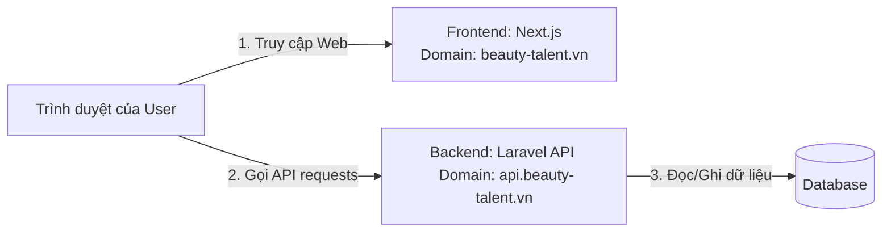

# Hướng Dẫn Chi Tiết: Tách và Liên Kết Độc Lập Frontend (Next.js) & Backend (Laravel)

Tài liệu này hướng dẫn chi tiết từng bước để tách thư mục `backend/` (Laravel) đang bị lồng bên trong dự án Next.js thành hai Repository độc lập, sau đó cấu hình để chúng giao tiếp với nhau qua API.

---

## PHẦN 1: Hướng Dẫn Tách Dự Án (Split)

### Bước 1: Trích xuất và khởi tạo Repository mới cho Backend (Laravel)

1. **Di chuyển mã nguồn Laravel ra ngoài:**
   * Di chuyển toàn bộ thư mục `backend` hiện tại ra một vị trí mới trên máy tính của bạn (nằm ngoài thư mục Next.js hiện tại).
   * Ví dụ, cấu trúc thư mục mới trên máy tính của bạn nên dạng:
     ```text
     C:\CONG_VIEC\
     ├── VNP_BeutyTalent (Chỉ chứa dự án Next.js)
     └── VNP_BeutyTalent_Backend (Thư mục Laravel mới dời ra)
     ```

2. **Khởi tạo Git cho Backend:**
   * Mở terminal tại thư mục backend mới (`VNP_BeutyTalent_Backend`).
   * Chạy các lệnh sau để khởi tạo Git riêng:
     ```powershell
     # Khởi tạo git
     git init

     # Đảm bảo đã có file .gitignore của Laravel (xem chi tiết ở Phần 2)
     # Thêm tất cả các file vào git
     git add .
     git commit -m "feat: init independent laravel backend"
     ```

3. **Đẩy code lên Git Server mới:**
   * Tạo một repository trống trên GitLab/GitHub (ví dụ tên là `vnp-beauty-talent-backend`).
   * Liên kết thư mục local với repo mới và push code lên:
     ```powershell
     git remote add origin <URL_REPO_BACKEND_MOI>
     git branch -M main
     git push -u origin main
     ```

### Bước 2: Dọn dẹp dự án Frontend (Next.js)

1. **Xóa thư mục `backend` cũ:**
   * Tại thư mục dự án gốc (`c:\CONG_VIEC\VNP_BeutyTalent`), tiến hành xóa thư mục con `backend/` đi.

2. **Cập nhật các cấu hình tối ưu:**
   * **TypeScript:** Mở file [tsconfig.json](file:///c:/CONG_VIEC/VNP_BeutyTalent/tsconfig.json#L33) và xóa bỏ `"backend"` khỏi mảng `"exclude"`, vì thư mục này không còn tồn tại ở đây nữa:
     ```diff
     - "exclude": ["node_modules", "backend"]
     + "exclude": ["node_modules"]
     ```
   * **ESLint:** Mở file [eslint.config.mjs](file:///c:/CONG_VIEC/VNP_BeutyTalent/eslint.config.mjs) và cập nhật cấu hình `globalIgnores` (nếu trước đó có thêm rule loại trừ backend) để đảm bảo sạch sẽ.
   * **Gitignore:** Mở file [.gitignore](file:///c:/CONG_VIEC/VNP_BeutyTalent/.gitignore) ở thư mục gốc Next.js, xóa các dòng cấu hình ignore liên quan đến Laravel nếu có.

3. **Commit và Push thay đổi của Frontend:**
   * Mở terminal tại thư mục gốc Next.js và chạy:
     ```powershell
     git add .
     git commit -m "build: remove nested backend project and optimize configurations"
     git push origin <branch-name>
     ```

---

## PHẦN 2: Hướng Dẫn Liên Kết Lại Với Nhau (Link & Connect)

Sau khi tách, hai dự án sẽ hoạt động độc lập. Dưới đây là cách cấu hình để chúng "nối" lại với nhau ở môi trường **Local (Máy cá nhân)**.

### Bước 1: Cấu hình phía Backend (Laravel)

Laravel cần cho phép ứng dụng Next.js gửi yêu cầu đến (Cấu hình CORS) và định cấu hình môi trường.

1. **Cấu hình file `.env` của Laravel:**
   * Tạo hoặc mở file `.env` trong thư mục Laravel:
     ```env
     APP_NAME=Laravel
     APP_ENV=local
     APP_KEY=base64:...
     APP_DEBUG=true
     APP_URL=http://localhost:8000  # URL chạy Laravel local

     # Cấu hình Database của bạn
     DB_CONNECTION=mysql
     DB_HOST=127.0.0.1
     DB_PORT=3306
     DB_DATABASE=vnp_beauty_talent
     DB_USERNAME=root
     DB_PASSWORD=
     ```

2. **Cấu hình CORS (Cross-Origin Resource Sharing):**
   * Laravel cần cho phép Next.js (chạy ở cổng `3000`) truy cập tài nguyên.
   * Mở file cấu hình CORS của Laravel tại `config/cors.php`. Định cấu hình đường dẫn cho phép nhận request từ Next.js:
     ```php
     return [
         'paths' => ['api/*', 'sanctum/csrf-cookie'],
         'allowed_methods' => ['*'],
         'allowed_origins' => ['http://localhost:3000'], // Cho phép Next.js gọi vào
         'allowed_origins_patterns' => [],
         'allowed_headers' => ['*'],
         'exposed_headers' => [],
         'max_age' => 0,
         'supports_credentials' => true, // Cần thiết nếu dùng session/cookie (như Laravel Sanctum)
     ];
     ```

3. **Khởi động Backend:**
   * Mở terminal tại thư mục Backend và chạy:
     ```powershell
     php artisan serve --port=8000
     ```
   * Server Laravel lúc này sẽ chạy tại địa chỉ: `http://127.0.0.1:8000` hoặc `http://localhost:8000`.

---

### Bước 2: Cấu hình phía Frontend (Next.js)

Next.js sẽ gọi API của Laravel thông qua biến môi trường.

1. **Tạo biến môi trường local:**
   * Tại thư mục gốc dự án Next.js, tạo/sửa file `.env.local` (file này đã được đưa vào `.gitignore` nên sẽ không bị đẩy lên Git công khai):
     ```env
     NEXT_PUBLIC_API_URL=http://localhost:8000/api
     ```

2. **Cách viết code gọi API trong Next.js:**
   * Khi gọi API (sử dụng `fetch` hoặc thư viện như `axios`), hãy sử dụng biến môi trường này.
   * Ví dụ mẫu trong một React Component (như [SurveyForm.tsx](file:///c:/CONG_VIEC/VNP_BeutyTalent/app/talent/survey/SurveyForm.tsx)):
     ```typescript
     // Lấy URL API từ biến môi trường
     const API_URL = process.env.NEXT_PUBLIC_API_URL;

     async function handleSubmitSurvey(formData: any) {
       try {
         const response = await fetch(`${API_URL}/talent/survey`, {
           method: "POST",
           headers: {
             "Content-Type": "application/json",
             "Accept": "application/json",
           },
           body: JSON.stringify(formData),
         });

         if (!response.ok) {
           throw new Error("Lỗi khi gửi khảo sát");
         }

         const data = await response.json();
         console.log("Thành công:", data);
       } catch (error) {
         console.error("Lỗi kết nối API:", error);
       }
     }
     ```

3. **Khởi động Frontend:**
   * Mở terminal tại thư mục Next.js và chạy:
     ```powershell
     npm run dev
     ```
   * Dự án Next.js lúc này chạy tại: `http://localhost:3000`.

---

## PHẦN 3: Khi Triển Khai Thực Tế (Production Deploy)

Khi đưa dự án lên môi trường chạy thực tế (Production), quy trình kết nối vẫn tương tự nhưng bạn sẽ thay đổi URL localhost thành tên miền thật:



### Các bước triển khai:

1. **Deploy Backend (Laravel):**
   * Triển khai lên máy chủ VPS (Ubuntu/Docker) hoặc các dịch vụ mây (AWS, Google Cloud).
   * Gán tên miền cho API, ví dụ: `https://api.beauty-talent.vn`.
   * Cập nhật file `.env` trên server:
     ```env
     APP_ENV=production
     APP_URL=https://api.beauty-talent.vn
     ```
   * Cập nhật `config/cors.php` để chỉ chấp nhận tên miền thật của Frontend:
     ```php
     'allowed_origins' => ['https://beauty-talent.vn'],
     ```

2. **Deploy Frontend (Next.js):**
   * Triển khai lên Vercel, Netlify hoặc Docker.
   * Gán tên miền cho web, ví dụ: `https://beauty-talent.vn`.
   * Cấu hình **Environment Variables** trên trang quản trị Vercel/Netlify của dự án:
     * Key: `NEXT_PUBLIC_API_URL`
     * Value: `https://api.beauty-talent.vn/api`
